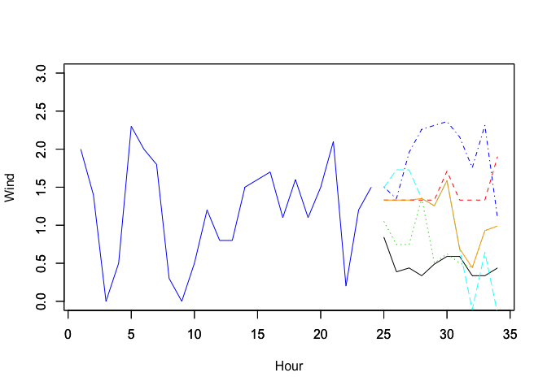

DTScanF
=======

[](https://zenodo.org/badge/latestdoi/108149425)

Overview
--------

An R package implementing innovative forecasting algorithm for wind time series.

Installation
------------

``` r
library(devtools)

devtools::install_github("leandromineti/DTScanF")
```

If you are a Windows user, make sure you have [Rtools](https://cran.r-project.org/bin/windows/Rtools/) installed.

``` r
library(DTScanF)

data("curvelo", package = "DTScanF")

res <- dtsf(ts = curvelo$vento, poli = 1, best = 5, window = 24, forecast = 10)

ts_f <- cbind(matrix(NA, ncol = 24, nrow = 5), res$forecasts)
wind <- c(tail(curvelo$vento, 24), rep(NA, 10))
res_forecasting <- c(rep(NA, 24), res$forecast)  # Aggregated by median

plot(wind, col = "blue", type = "l", ylim = c(0, 3), ylab = "Wind", xlab = "Hour")
par(new=T)
matplot(t(ts_f), type = "l", ylim = c(0, 3), ylab = "", xlab = "")
par(new=T)
lines(res_forecasting, col = "orange")
```


